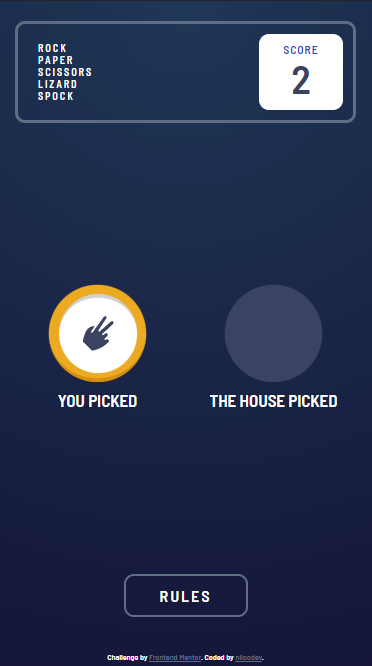
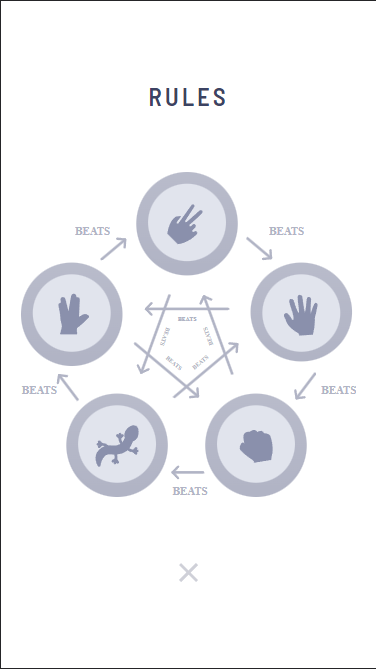
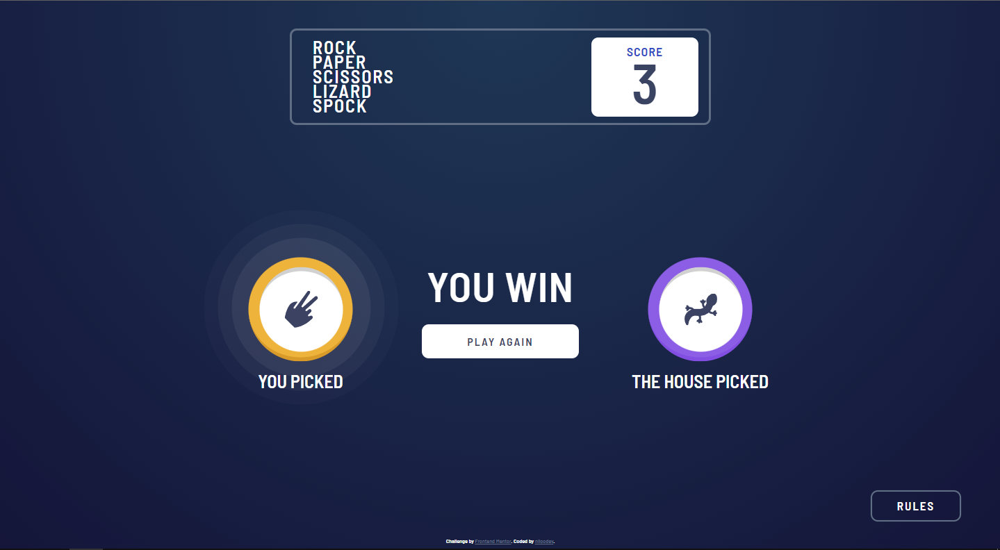

# FRONTEND MENTOR - SOLUTION TO THE JANKENPO CHALLENGE 

This is one of the solutions to the [Frontend Mentor's Rock, Paper, Scissors Challenge](https://www.frontendmentor.io/challenges/calculator-app-9lteq5N29).
*I did the challenge in bonus mode, which is basically adding "lizard" and "spock" to the game - a reference to Star Trek and a custom game that has been around in the geek community since 1998, created by Sam Kass, a software engineer.
You can see the React code in the "src" folder.

See the real-time solution [here](https://jankenpo-challenge.vercel.app/).

## SUMMARY

- [ABSTRACT](#ABSTRACT)
  - [CHALLENGE](#CHALLENGE)
  - [IMAGES | PRINTS](#PRINTS)
- [PROCESS](#PROCESS)
  - [TOOLS USED](#TOOLS)
- [AUTHOR | CREDITS](#AUTHOR)

## ABSTRACT
This was a bit more of a challenge, since I wanted to animate some components and keep the dynamics of the page interactive and visually pleasing. I chose to use React for the additional libraries it provides and the dynamics through the components' states.

### CHALLENGE

This challenge has a little more demanding specifications, since it is very dynamic and strict in its mechanics.

You can use whatever tools you want to complete the challenge.

Users must be able to

- See the elements on the screen from the device resolution without distortions (**responsivity**).
- Choose and interact with game components, resulting in a win or loss against a supposed "bot".
- Be able to access the rules easily and simply, without complications.
- **Bonus**: Adding "spock" and "lizard" to the game, as was the case.

### PRINTS

### MOBILE

## DESKTOP

## PROCESS
I started the project in React and my first step was to build the base in JSX, I separated the color variables - that the challenge provides - in my "App.css" file and left the "index.css" file for more structural changes; like the minimum page size and that kind of responsiveness, and the font definition.

Then I gradually developed the app, I divided it into three parts: the header, the center (which encompasses the selection screen and the game screen itself) and the bottom (which on wider devices would become absolute and go to the bottom right corner, as the challenge asks in its example design). I went about developing the existing components in them, adjusting the individual responsiveness of each.

Once, close to finishing the visuals, I started developing the logic behind the game - which is quite easy, **each hand beats two other hands and loses to the rest, except for itself, a chance that can be easily eliminated at the beginning of the function when comparing the two** - and finished with some adjustments to the overall responsiveness.

### TOOLS

- React
- [Framer Motion](https://www.framer.com/motion/)
- The concept of ["Mobile-First"](https://www.youtube.com/watch?v=g_gXar45uR8)
- CSS
- Font ["Barlow Semi Condensed"](https://fonts.google.com/specimen/Barlow+Semi+Condensed)

## AUTHOR
**made by niloodev | Ezequiel Nilo**

**ANY TIPS OR FEEDBACK IS HIGHLY APPRECIATED! 🐸**
